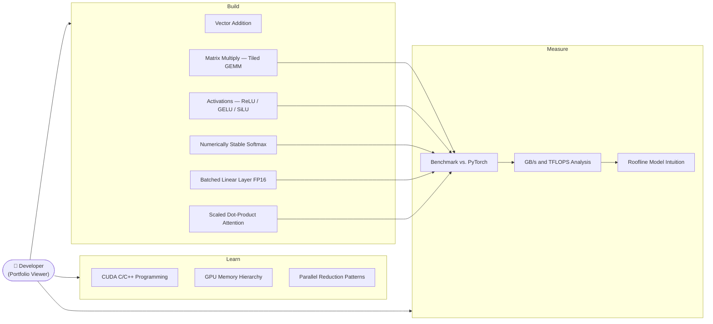
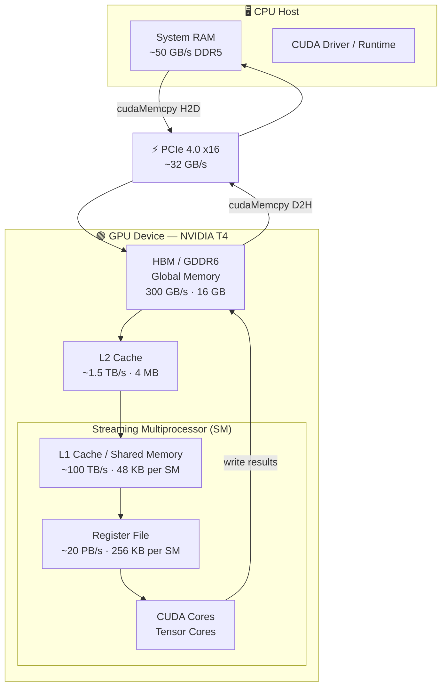
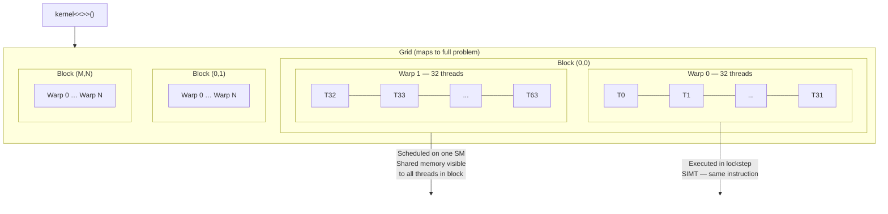
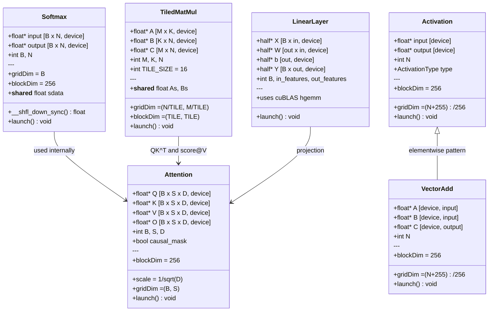
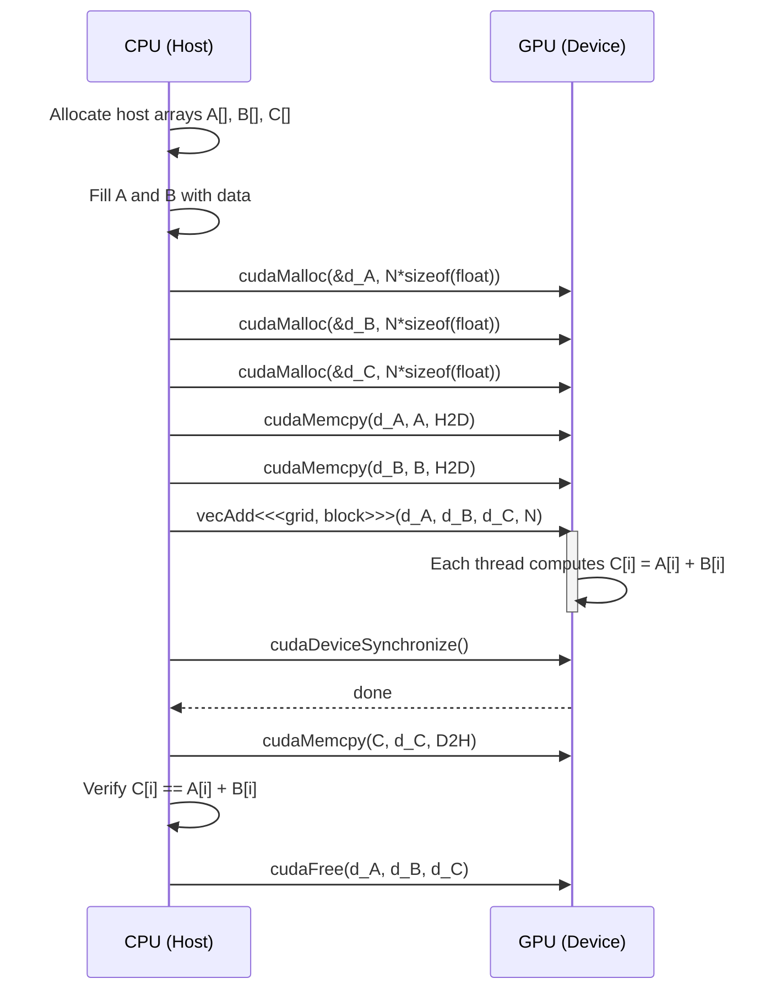
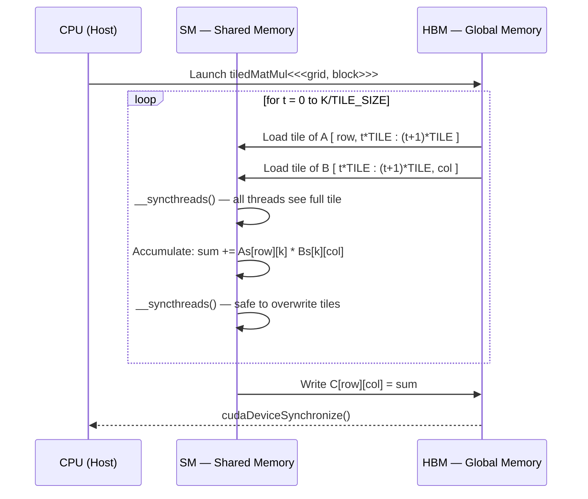
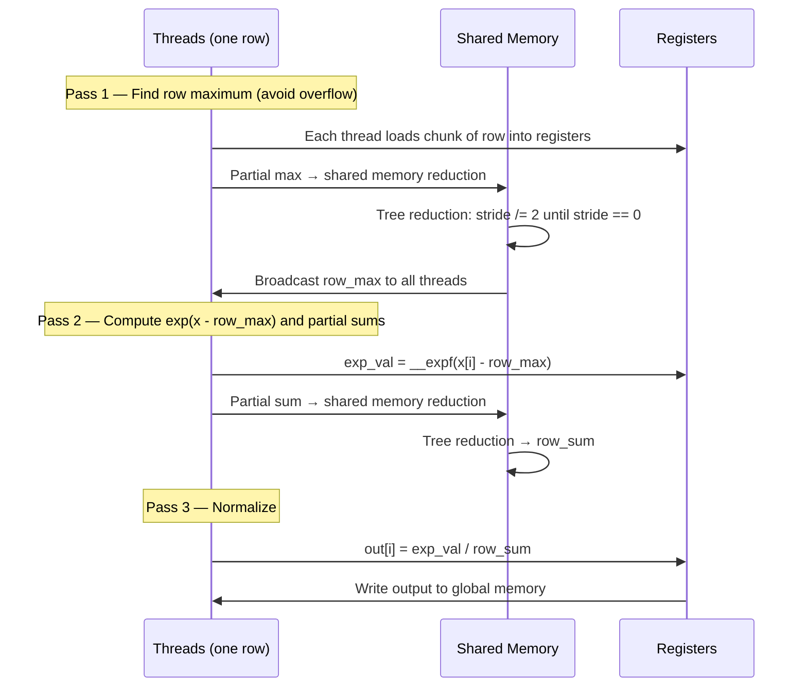
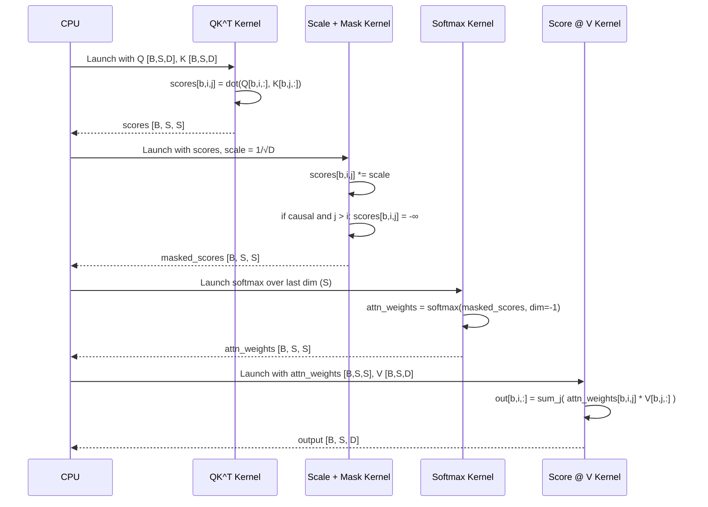
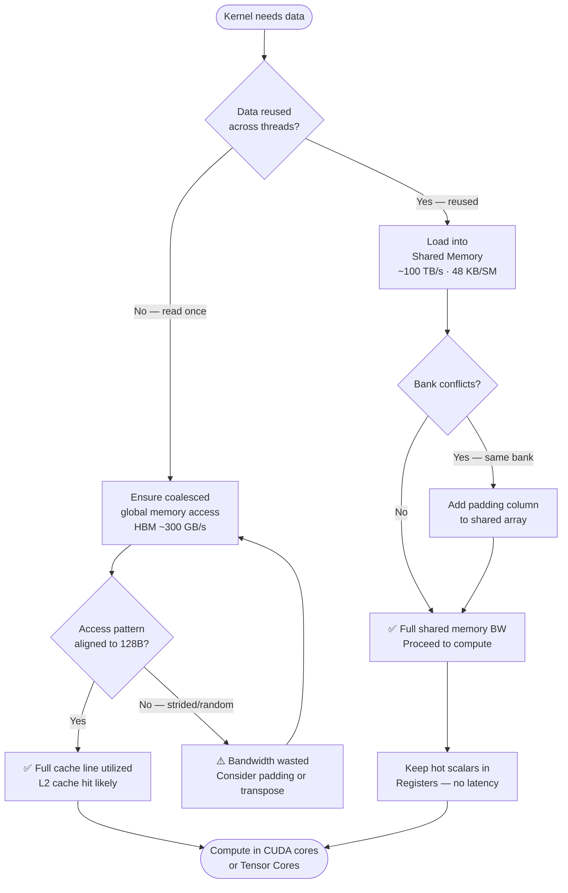
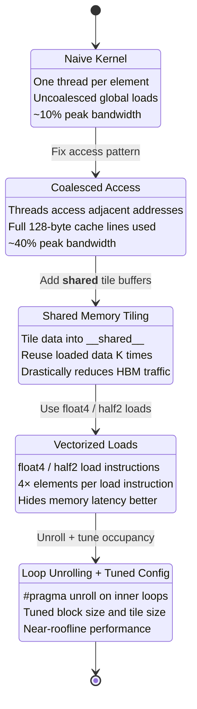

# CUDA ML Primitives — Architecture Diagrams

All diagrams render natively on GitHub via Mermaid.

---

## How to Read These Diagrams

Read them in this order — each one builds on the last.

### Start with the mental model (Diagrams 2 → 3 → 9)

**Diagram 2 (Architecture)** answers: *where does data live and how fast can we get to it?*

This is the most important diagram in the whole project. Every optimization you'll see in the notebooks is about moving data *up* this hierarchy — away from slow HBM (300 GB/s) and into shared memory or registers. If a kernel is slow, it's almost always because it's hitting HBM too much.

**Diagram 3 (Execution Model)** answers: *how does code actually run on the GPU?*

Your PyTorch mental model is "tensors transform into tensors." The CUDA mental model is "thousands of threads run the same function simultaneously." The hierarchy is:
- **Grid** = the whole problem
- **Block** = a group of threads that share memory and can synchronize
- **Warp** = 32 threads that execute *literally the same instruction at the same time* (SIMT)
- **Thread** = one worker, doing one element

The key insight: threads in the same *block* can communicate through shared memory. Threads in different blocks cannot.

**Diagram 9 (Memory Activity)** is the decision tree you'll use when writing every kernel: *should I use shared memory? Are my accesses coalesced?*

### Then understand the optimization journey (Diagram 10)

**Diagram 10 (State: Optimization Progression)** is the narrative arc of the whole project. Every notebook follows this path — you'll implement the naive version first, then apply each optimization and watch the numbers improve. The benchmark table in the README is the scorecard.

### Then read the sequences top-to-bottom as recipes (Diagrams 5 → 6 → 7 → 8)

Each sequence diagram is a recipe for one kernel. Read them like a protocol: what happens on the CPU, what gets sent to the GPU, what the GPU does internally, what comes back.

**Diagram 5 (Vector Add)** is the "hello world" — just the boilerplate lifecycle every CUDA program follows. Every other kernel does the same `malloc → memcpy → launch → sync → memcpy → free` pattern, just with more interesting work in the middle.

**Diagram 6 (Tiled MatMul)** is where shared memory first appears. The loop is the key: instead of each thread reading from slow HBM for every multiply, a whole block loads a *tile* into fast shared memory, does all the math, then loads the next tile. This is the core optimization pattern used everywhere in deep learning.

**Diagram 7 (Softmax)** introduces *parallel reduction* — how you compute a global aggregate (max, sum) across thousands of threads. This pattern (`__shfl_down_sync`, tree reduction) comes up in layer norm, batch norm, cross-entropy, and attention.

**Diagram 8 (Attention)** is the capstone. It's just diagrams 6 and 7 composed: QK^T is a matmul, the softmax over scores is diagram 7, then score@V is another matmul.

### Skip for now (Diagrams 1, 4)

**Diagram 1 (Use Case)** is for recruiters, not for learning. Skim it.

**Diagram 4 (Class Diagram)** is a reference. Don't read it front-to-back — use it later to look up a kernel's expected inputs and launch configuration when you're in a notebook and forget the shape.

### One-sentence summary

The entire project is diagram 9 applied repeatedly: *every kernel we write is asking "how do I move data from HBM into shared memory and registers as efficiently as possible?"* The sequence diagrams show the pattern for each primitive, and diagram 10 shows how we improve each one step by step.

---

## 1. Use Case Diagram

What this project demonstrates and who it's for.

---

## 2. Architecture Diagram — Host ↔ Device Memory Hierarchy

How CPU (host) and GPU (device) interact, and the GPU memory hierarchy from slowest to fastest.

---

## 3. CUDA Execution Model — Grid / Block / Warp / Thread

The four-level hierarchy launched by every kernel call.

---

## 4. Class Diagram — Kernel Interface Summary

Each CUDA kernel modeled as a class showing inputs, outputs, and launch parameters.

---

## 5. Sequence Diagram — Vector Addition

The full host/device lifecycle for the simplest CUDA program.

---

## 6. Sequence Diagram — Tiled Matrix Multiply

One output tile's computation showing the shared-memory tile loop.

---

## 7. Sequence Diagram — Numerically Stable Softmax

Three-pass parallel reduction: max → exp/sum → normalize.

---

## 8. Sequence Diagram — Scaled Dot-Product Attention

Full attention primitive: QK^T → scale → causal mask → softmax → score@V.

---

## 9. Activity Diagram — GPU Memory Hierarchy Access Pattern

Decision flow a kernel author takes to minimize memory bottlenecks.

---

## 10. State Diagram — Kernel Optimization Progression

The iterative optimization journey from naive to high-performance.

